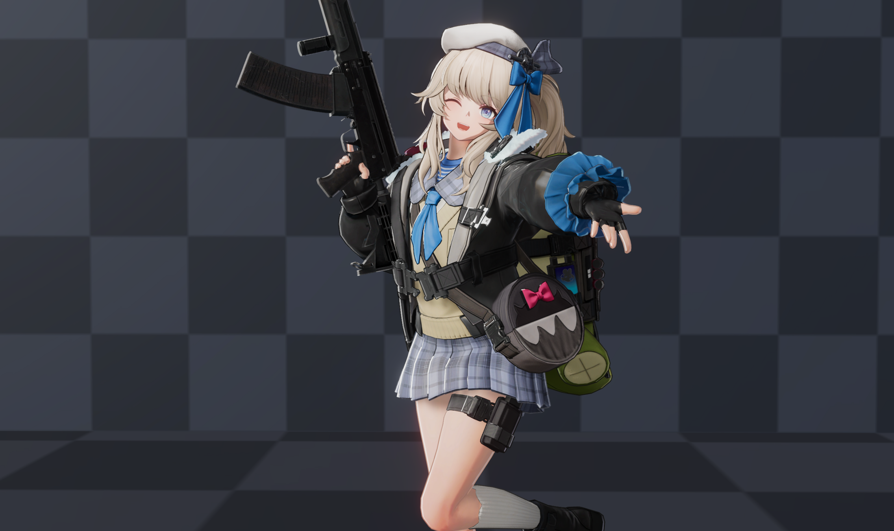
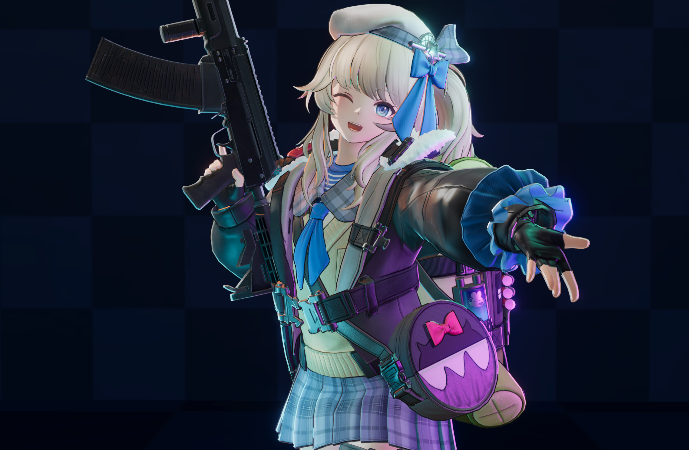
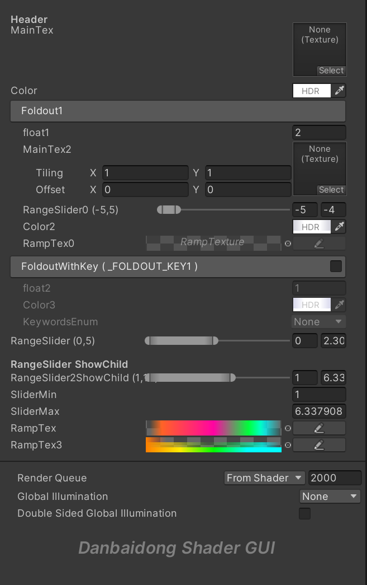
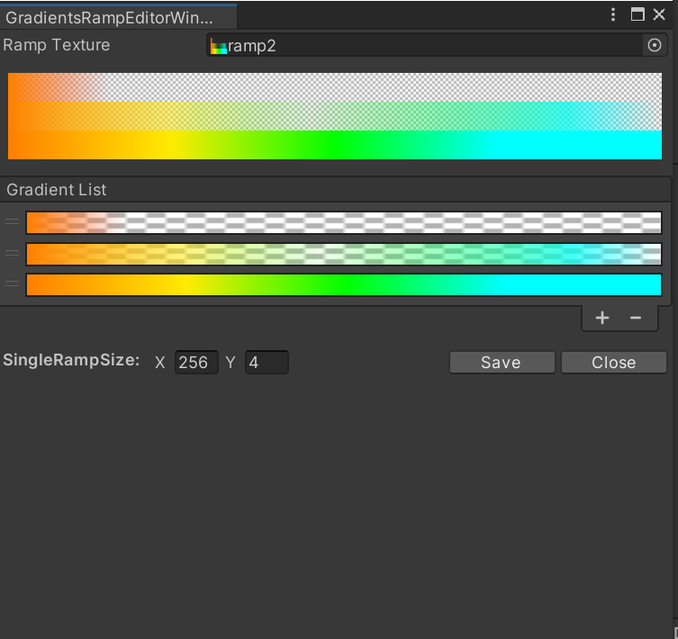
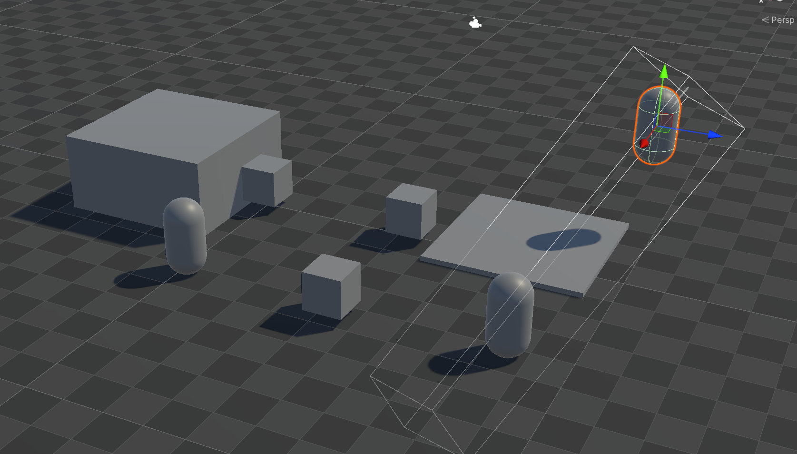
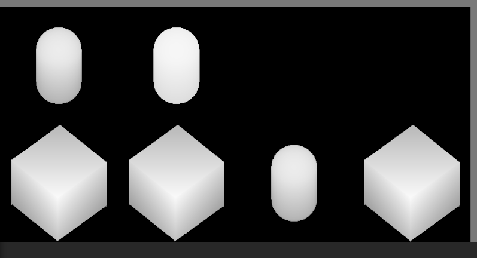

  
   # **Danbaidong Render Pipeline**

   ## Announcement
   Just add something I need.

   `DanbaidongRP` based on Universal RP 14.0.8, Unity 2022.3. It's more convenient for PBR/NPR Toon Rendering. In the future, I will move in some things according to my own needs.

Follow me~

https://space.bilibili.com/39694821

https://www.zhihu.com/people/danbaidong1111

Currently completed modules
- PBR Toon Shader
- Danbaidong Shader GUI
- PerObjectShadow
- Inserted GBuffer Passes
- Toon Bloom
- Anime Toonmapping

Roadmap
- Cluster Deferred lighting( It seems that unity has already implemented it in forward+ )
- Atmosphere Fog
- PCSS/PCF Soft Shadows
- Gradient Shadows
- Transparent Shadows
- High Quality SSR
- High Quality SSGI
- Idol Live アイドル!!!!!

# Toon Rendering

# Danbaidong Shader GUI

# PerObjectShadow

